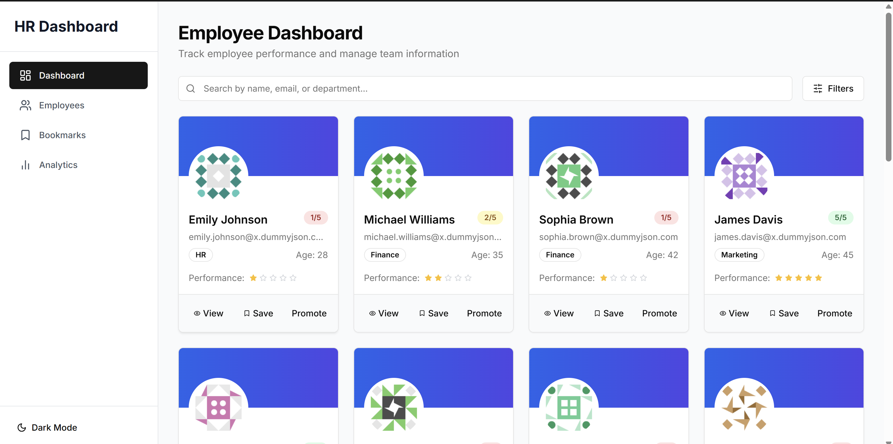
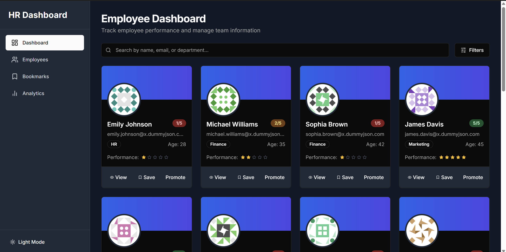
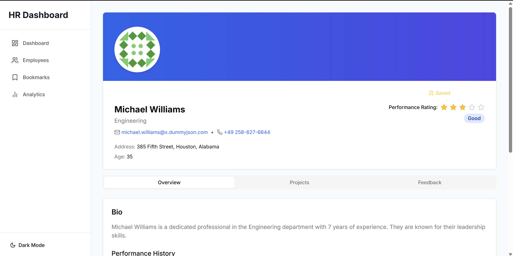
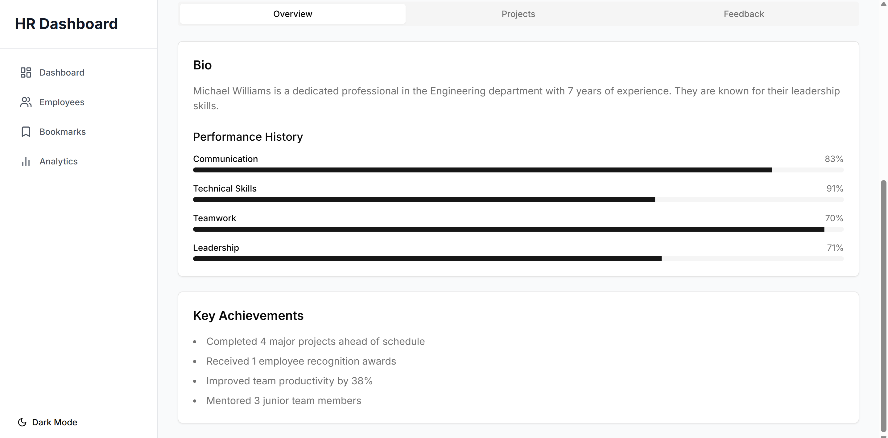
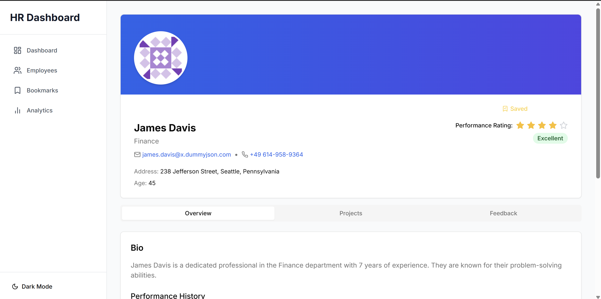
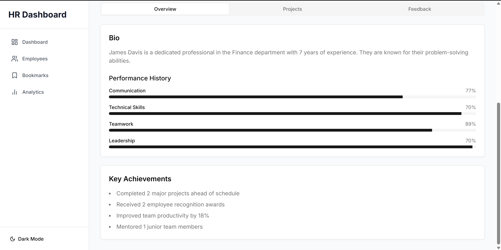
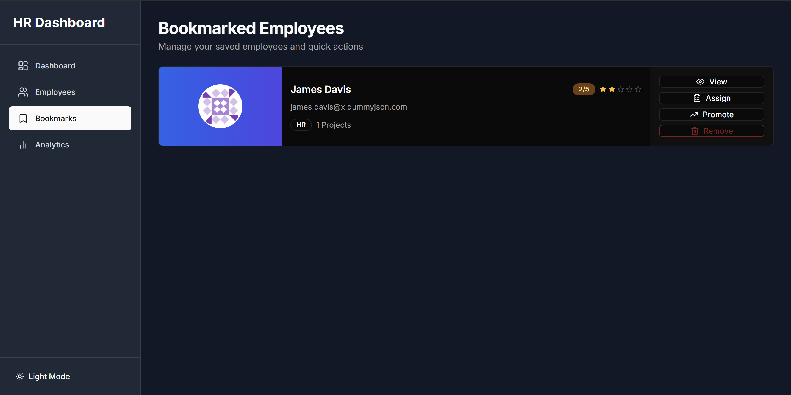
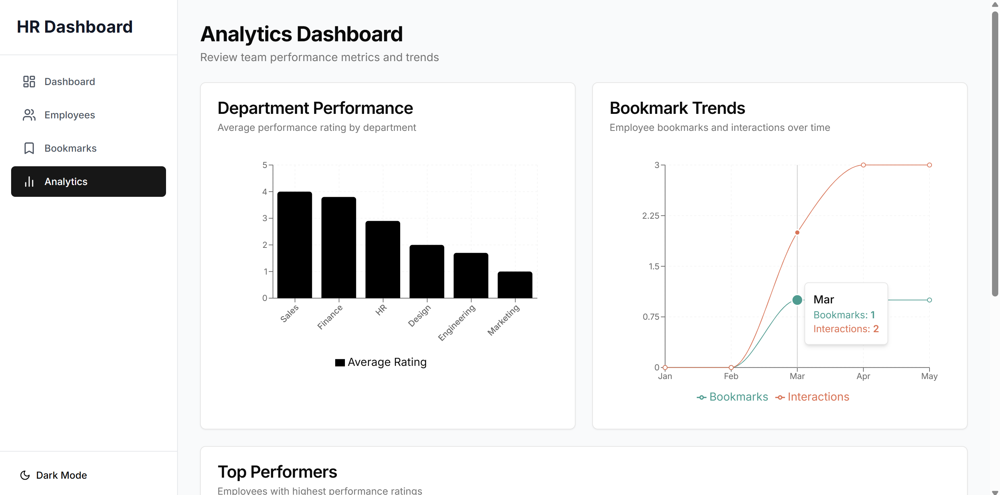
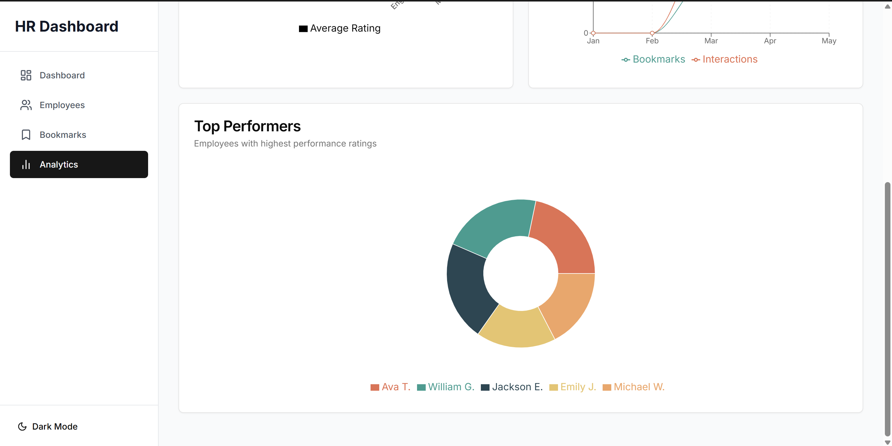

# HR Dashboard

## 🛠️ Setup Instructions

Follow the steps below to set up and run the project locally:

### 1. **Clone the Repository**

```bash
git clone https://github.com/your-username/Hr-Dashboard.git
cd Hr-Dashboard
```

### 2. **Install Dependencies**

Make sure you have Node.js installed. Then run the following command:

```bash
npm install
```

### 3. **Run the Development Server**

Start the development server with:

```bash
npm run dev
```

Then open your browser and navigate to:

```
http://localhost:3000
```

---

## ✅ Features Implemented

### 🏠 Dashboard Homepage (`/`)
- Displays 20 employees fetched from `https://dummyjson.com/users?limit=20`
- Employee card includes:
  - Full Name, Email, Age, Department
  - Performance rating (1–5 stars)
  - Buttons: `View`, `Bookmark`, `Promote`

### 🔍 Search & Filter
- Search bar filters by name, email, or department (case-insensitive)
- Multi-select filter by department and performance rating

### 👤 Dynamic Employee Profile (`/employee/[id]`)
- Detailed user profile with:
  - Address, Phone, Bio, Past performance history
  - Tabs: `Overview`, `Projects`, `Feedback` (with dynamic mock data)

### 📑 Bookmark Manager (`/bookmarks`)
- Lists all bookmarked employees
- Allows removing bookmarks
- UI actions: `Promote`, `Assign to Project`

### 📊 Analytics Page (`/analytics`)
- Interactive charts (via Chart.js) showing:
  - Department-wise average ratings
  - Bookmark trends

---

## 🌙 Additional Features

- **Dark/Light mode** toggle using Tailwind CSS
- **Reusable Components**: Card, Badge, Modal, Button
- **Responsive Design** from mobile to desktop
- **Modular Folder Structure**: `components/`, `hooks/`, `lib/`, etc.


---

## 📸 Screenshots

### Dashboard Homepage Light Mode

  


### Dashboard Homepage Light Mode




### Searching Employees


### Employee Details Page

  


  


  





### Bookmarked Employees Page




### Analytics Page

  

  



---
