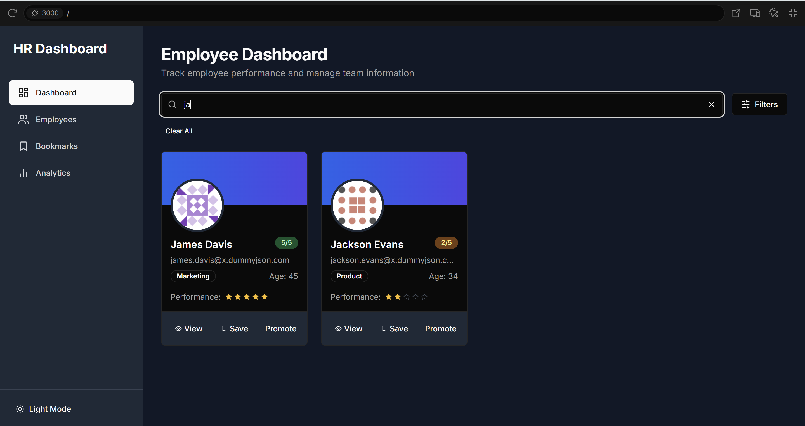

# Hr-Dashboard


## 🛠️ Setup Instructions

  Follow the steps below to set up and run the project locally:
  
  ### 1. **Clone the Repository**
  
  ```bash
  git clone https://github.com/your-username/Hr-Dashboard.git
  cd Hr-Dashboard
  
  
  ### 2. Install Dependencies
  
    Make sure you have Node.js installed. Then run the following command in your terminal:
      npm install
  #### 3. Run the Development Server
  After installing dependencies, start the development server with:
    npm run dev
  Then open your browser and navigate to:
    http://localhost:3000


**## ✅ Features Implemented**

###  Dashboard Homepage (`/`)
- Displays 20 employees fetched from `https://dummyjson.com/users?limit=20`.
- Employee card includes:
  - Full Name, Email, Age, Department
  - Performance rating (1–5 stars)
  - Buttons: `View`, `Bookmark`, `Promote`

###  Search & Filter
- Search bar filters by name, email, or department (case-insensitive).
- Multi-select filter by department and performance rating.

###  Dynamic Employee Profile (`/employee/[id]`)
- Detailed user profile with:
  - Address, Phone, Bio, Past performance history
  - Tabs: `Overview`, `Projects`, `Feedback` (dynamic mock data)

###  Bookmark Manager (`/bookmarks`)
- Lists all bookmarked employees.
- Allows removing bookmarks and UI actions like "Promote", "Assign to Project".

###  Analytics Page (`/analytics`)
- Interactive charts (via Chart.js) showing:
  - Department-wise average ratings
  - Bookmark trends

---

## 🌙 Additional Features

- **Dark/Light mode** toggle using Tailwind
- **Reusable Components**: Card, Badge, Modal, Button
- **Responsive design** from mobile to desktop
- **Modular folder structure**: `components/`, `hooks/`, `lib/`, etc.
- **Custom hooks**: `useBookmarks`, `useSearch`
- **Error/loading states** handled gracefully


**### ScreenShots ###**

DashBoard-Home Pages


Searching 



Employee Details Page


BookMarked Employees Page


Analytics Page


